<p align="center">
  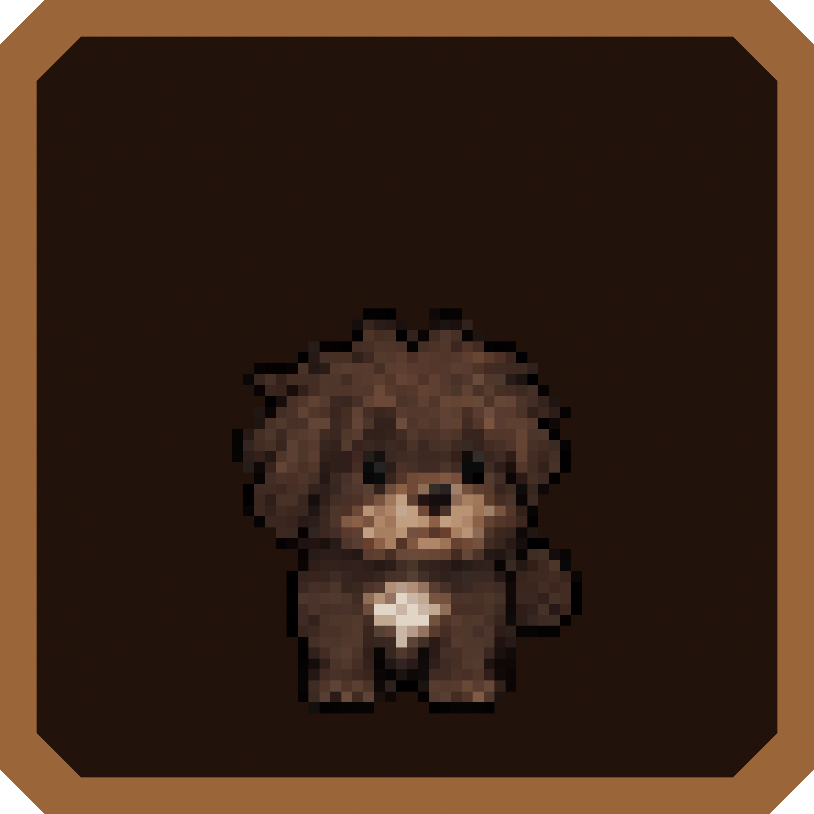
</p>

<h1 align="center">MACOMON</h1>

<p align="center">
  <strong>Tiny animated companions for the top of your Mac.</strong><br>
  <code>MENU BAR • NOTCH • DESKTOP • ACTIVE WINDOW • FREE ROAM</code>
</p>

<p align="center">
  
  
  
  
  
</p>

<p align="center">
  
  
  
  
</p>

<!--
  Note: this repo is currently private, so live GitHub badges (workflow status,
  last commit, issues, contributors) can't be resolved by shields.io. Swap the
  static badges above for the dynamic versions below once the repo goes public:

  
  
  
  
-->


<p align="center">
  <a href="../../releases/latest"></a>
  <a href="CONTRIBUTING.md"></a>
  <a href="../../issues/new/choose"></a>
</p>

<p align="center">
  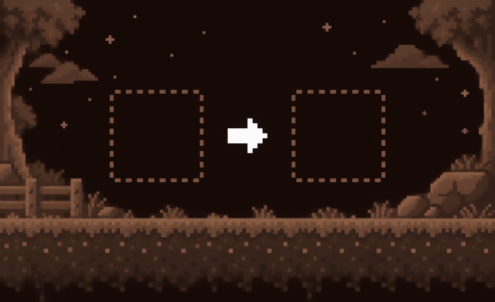
</p>

```text
╔══════════════════════════════════════════════════════════════╗
║  A TINY PIXEL WORLD LIVING ABOVE YOUR WINDOWS              ║
╚══════════════════════════════════════════════════════════════╝
```

Macomon is a native macOS menu-bar and desktop-pet app. Pick from **634 Pokémon and variants** across five generations, or choose one of the handcrafted animal companions. They walk, rest, play, react to your Mac, and follow you across Spaces.

<details>
<summary><strong>▸ QUEST LOG (table of contents)</strong></summary>

- [Choose your companion](#choose-your-companion)
- [Five generations, one menu](#five-generations-one-menu)
- [Features](#features)
- [The world reacts](#the-world-reacts)
- [Install](#install)
- [Build from source](#build-from-source)
- [Add another companion](#add-another-companion)
- [Project map](#project-map)
- [Contributing](#contributing)
- [Contributors](#contributors)
- [Legal](#legal)
- [License](#license)

</details>

## Choose your companion

<table align="center">
  <tr>
    <td align="center" width="260">
      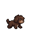<br>
      <strong>Little Dog</strong><br>
      <sub>17 behaviors · umbrella weather reaction</sub>
    </td>
    <td align="center" width="260">
      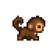<br>
      <strong>Baby Monkey</strong><br>
      <sub>18 behaviors · leaf weather reaction</sub>
    </td>
  </tr>
</table>

<p align="center">
  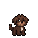
  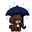
  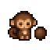
  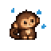
</p>

## Five generations, one menu

<p align="center">
  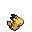
  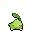
  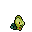
  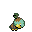
  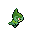
</p>

- Dedicated **Pokémons** menu, organized by generation
- Default and Shiny variants where available
- Pixel-perfect nearest-neighbor rendering
- Automatic left-facing fallback through sprite mirroring
- Dedicated left-facing animations when supplied

## Features

| System | What it does |
|---|---|
| **Menu bar pet** | Walks between your normal macOS status icons |
| **Notch mode** | Detects the camera area and keeps the pet visible beside it |
| **Desktop mode** | Lives along the bottom edge of the current desktop |
| **Window / tab-bar mode** | Sits on top of the active window |
| **Free placement** | Drag the pet anywhere and let it roam around that point |
| **All Spaces** | Remains visible while switching desktops with the trackpad |
| **Four sizes** | 24, 32, 48, or 64 px in overlays; optimized sizes in the menu bar |
| **Movement controls** | Three speeds and three travel ranges |
| **Companion moods** | Balanced, random, calm, playful, and active |
| **Interactions** | Left-click for a reaction; right-click for the menu |
| **Autostart** | Can launch automatically when the Mac starts |

## The world reacts

Macomon can select contextual animations when the current companion supports them:

- **Rain and thunderstorms** — umbrella for the dog, leaf shelter for the monkey
- **Time of day** — sleeping at night or stretching in the morning
- **Battery level** — calmer behavior when power is low
- **Charging** — happy reactions while the Mac charges

Weather uses an approximate macOS location and [Open-Meteo](https://open-meteo.com/). Time and power reactions stay local. Every reaction can be disabled independently.

## Install

1. Download the latest DMG from [GitHub Releases](../../releases/latest).
2. Open it.
3. Drag `Macomon.app` onto `Applications`.
4. Launch Macomon from the Applications folder.

The installer is a small 8-bit level of its own — no README obstacle, just drag and drop.

> macOS may ask for confirmation before allowing launch-at-login or approximate location access.

## Build from source

Requirements: macOS 13 or newer and Xcode Command Line Tools.

```bash
git clone https://github.com/lionnsb/Macomon.git
cd Macomon
./scripts/build-app.sh
open dist/Macomon.app
```

Build the application and the styled DMG together:

```bash
./scripts/build-installer.sh
```

Run the complete resource and behavior check without opening the UI:

```bash
dist/Macomon.app/Contents/MacOS/Macomon --self-test
```

## Add another companion

Create a directory under `pets/` and follow the animation naming convention:

```text
pets/red_panda/
├── default_idle_8fps.gif
├── default_walk_8fps.gif
├── default_walk_left_8fps.gif
├── default_sleep_zzz_8fps.gif
├── default_happy_hearts_8fps.gif
└── default_rain_leaf_8fps.gif
```

Recommended asset specification:

- Transparent GIF
- 64 × 64 px canvas
- Pixel-perfect binary alpha
- Seamless loop
- Consistent proportions and palette
- Weather-only behavior names beginning with `rain_`

The reusable generation brief lives in [`support/PIXELLAB-BEGLEITER-PROMPT.txt`](support/PIXELLAB-BEGLEITER-PROMPT.txt).

## Project map

```text
Macomon/
├── Sources/Macomon/        # Native AppKit application
├── gen1 ... gen5/          # Pokémon animation collections
├── pets/                   # Original animal companions
├── scripts/                # App, icon, and DMG build pipeline
├── support/                # Metadata and visual assets
└── Package.swift           # Swift package definition
```

## Contributing

Bug reports and ideas are welcome. Please read [`CONTRIBUTING.md`](CONTRIBUTING.md) before submitting changes. Only contribute artwork you have permission to share.

```text
╔══════════════════════════════════════════════════════════════╗
║  1UP GRANTED — SUBMIT A PR AND JOIN THE PARTY               ║
╚══════════════════════════════════════════════════════════════╝
```

<p align="center">
  <a href="../../fork"></a>
  <a href="../../issues/new/choose"></a>
  <a href="../../discussions"></a>
</p>

## Contributors

<p align="center">
  <a href="../../graphs/contributors"></a>
</p>

<p align="center"><sub>Every trainer who ships a PR gets added to the party.</sub></p>

<!--
  Note: contrib.rocks (https://contrib.rocks/image?repo=lionnsb/Macomon) renders
  contributor avatars automatically, but only for public repos. Swap the badge
  above for that image once this repo goes public:

  <a href="../../graphs/contributors">
    
  </a>
-->


## Legal

Macomon is a personal, non-commercial fan project and is not affiliated with, endorsed by, or sponsored by Nintendo, Game Freak, Creatures Inc., or The Pokémon Company. Pokémon names, characters, sprites, and related trademarks belong to their respective owners.

The original companion artwork and application source are separate from those third-party properties. Do not redistribute third-party assets outside the scope permitted by their owners.

## License

The Macomon source code and original companion artwork are licensed under the [MIT License](LICENSE). Third-party Pokémon assets are excluded — see [Legal](#legal) above.

```text
PRESS START. PICK A FRIEND. KEEP WORKING.  ▸
```
